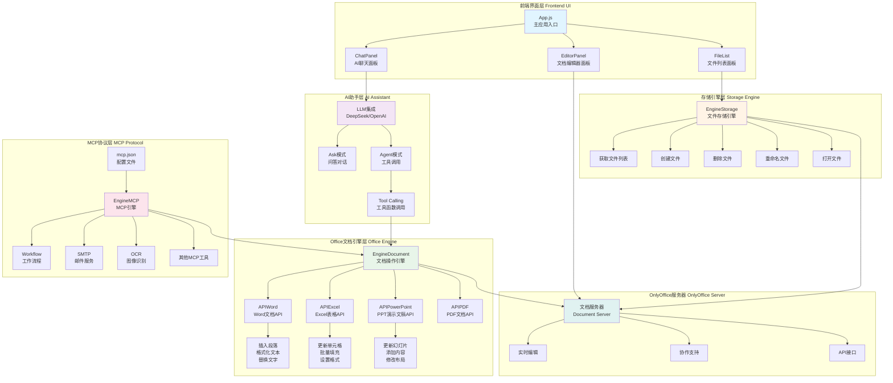

# OA-Pilot 组件架构图

## 架构图



## 组件说明

### 1. 前端界面层 (Frontend UI)

#### App.js - 主应用入口
- 负责整体三栏布局管理
- 协调各个面板之间的通信
- 管理全局状态

#### FileList - 文件列表面板（左侧）
- 显示OnlyOffice服务器上的所有文档
- 支持点击打开文档
- 提供文件管理功能
- 可折叠以最大化工作空间

#### EditorPanel - 文档编辑器面板（中间）
- 集成OnlyOffice文档编辑器
- 支持Word、Excel、PowerPoint在线编辑
- 实时协作编辑
- 提供文档自动化API

#### ChatPanel - AI聊天面板（右侧）
- AI助手交互界面
- 支持两种模式：Ask模式和Agent模式
- 显示对话历史
- 提供MCP配置加载功能

---

### 2. 存储引擎层 (Storage Engine)

#### EngineStorage - 文件存储引擎
统一的文件操作接口，提供以下功能：

- **获取文件列表**: 从OnlyOffice服务器获取所有文档
- **创建文件**: 支持创建Word (.docx)、Excel (.xlsx)、PowerPoint (.pptx)、PDF文件
- **删除文件**: 从服务器删除指定文档
- **重命名文件**: 修改文档名称
- **打开文件**: 在编辑器中打开指定文档

**API端点**: `${config.storageEngineURL}example/files`

---

### 3. Office文档引擎层 (Office Engine)

#### EngineDocument - 文档操作引擎
- 定义所有文档操作工具（OpenAI Function Calling格式）
- 协调各个Office API的调用
- 提供统一的工具描述接口

#### APIWord - Word文档API
Word文档操作功能：
- **updateParagraph**: 插入新段落
- **insertFormattedText**: 插入格式化文本（粗体、斜体、下划线）
- **replaceCurrentWord**: 替换选中的文本
- **insertTable**: 插入表格（待实现）

#### APIExcel - Excel表格API
Excel表格操作功能：
- **updateSpreadsheet**: 更新单元格内容
- **批量数据填充**: 填充多个单元格
- **设置单元格格式**: 粗体、颜色等样式

#### APIPowerPoint - PPT演示文稿API
PowerPoint操作功能：
- **updatePresentation**: 更新幻灯片内容
- **指定幻灯片索引**: 操作特定页面
- **修改文本框内容**: 更新幻灯片中的文字

#### APIPDF - PDF文档API
- PDF文档操作（待实现）

**技术实现**: 通过OnlyOffice的`createConnector()`和`callCommand()`API执行文档操作

---

### 4. AI助手层 (AI Assistant)

#### LLM集成 - DeepSeek/OpenAI
集成大语言模型，支持两种工作模式：

##### Ask模式 - 问答对话
- 普通聊天对话
- 回答用户问题
- 不执行文档操作
- 轻量级交互

##### Agent模式 - 工具调用
- 主动调用文档操作工具
- 理解用户意图并执行操作
- 支持OpenAI Function Calling
- 自动化文档处理

#### Tool Calling - 工具函数调用
- 解析LLM返回的工具调用请求
- 执行对应的文档操作
- 返回执行结果给LLM
- 支持多轮对话

**配置**:
```javascript
{
  model: 'deepseek-chat',
  tools: [...], // OpenAI Function Calling格式
  tool_choice: 'auto'
}
```

---

### 5. MCP协议层 (MCP Protocol)

#### EngineMCP - MCP引擎
Model Context Protocol引擎，扩展AI能力：

##### Workflow - 工作流程
- 定义自动化工作流程
- 串联多个操作步骤
- 条件分支处理

##### SMTP - 邮件服务
- 发送邮件通知
- 邮件模板支持
- 附件处理

##### OCR - 图像识别
- 图片文字识别
- 扫描文档处理
- 表格识别

##### 其他MCP工具
- 可扩展的工具集
- 支持自定义MCP服务器
- 标准化的工具接口

#### mcp.json - 配置文件
MCP工具配置文件，定义：
- 工具名称和描述
- 参数结构
- 调用方式
- 示例用法

**示例工具**:
```json
{
  "name": "insert_text",
  "description": "Insert plain text into the document",
  "parameters": {
    "text": {
      "type": "string",
      "description": "The text to insert"
    }
  }
}
```

---

### 6. OnlyOffice服务器 (OnlyOffice Server)

#### 文档服务器 - Document Server
后端文档处理服务：

##### 实时编辑
- WebSocket连接
- 实时同步文档变更
- 多用户并发编辑

##### 协作支持
- 用户权限管理
- 评论和批注
- 版本历史

##### API接口
- Document Editor API
- Connector API for automation
- REST API for file management

**服务器地址**: `http://192.168.50.156/`

---

## 数据流向

### 文件操作流程
```
用户操作 → FileList → EngineStorage → OnlyOffice Server → EditorPanel
```

### AI文档操作流程
```
用户输入 → ChatPanel → LLM → Tool Calling → EngineDocument → 
APIWord/APIExcel/APIPowerPoint → OnlyOffice Connector → 文档更新
```

### MCP扩展流程
```
用户输入 → ChatPanel → Agent模式 → EngineMCP → 
Workflow/SMTP/OCR → 外部服务 → 结果返回
```

---

## 技术栈

### 前端
- **React**: UI框架
- **OnlyOffice Document Editor**: 文档编辑器组件
- **OpenAI SDK**: LLM客户端

### 后端
- **OnlyOffice Document Server**: 文档处理服务
- **DeepSeek API**: 大语言模型服务
- **MCP Protocol**: Model Context Protocol

### API标准
- **OpenAI Function Calling**: 工具调用标准
- **OnlyOffice API**: 文档操作接口
- **MCP**: 模型上下文协议

---

## 核心特性

### 1. 三栏式布局
- 左侧：文件浏览和管理
- 中间：文档编辑器
- 右侧：AI助手

### 2. AI驱动的文档自动化
- 自然语言命令
- 自动执行文档操作
- 智能理解用户意图

### 3. 双模式AI助手
- Ask模式：问答咨询
- Agent模式：自动化操作

### 4. 可扩展的MCP协议
- 标准化工具接口
- 支持第三方服务集成
- 灵活的配置方式

### 5. 多文档类型支持
- Word文档
- Excel表格
- PowerPoint演示文稿
- PDF文档（规划中）

---

## 使用场景

1. **文档自动化处理**: 通过AI命令批量处理文档
2. **智能文档编辑**: 语音或文字指令控制文档编辑
3. **工作流自动化**: 结合MCP实现复杂工作流程
4. **协作办公**: 多人实时协作编辑文档
5. **文档智能生成**: AI辅助生成报告、演示文稿等

---

## 配置示例

### config.js
```javascript
const config = {
  baseURL: "http://192.168.50.156/",
  storageEngineURL: "http://192.168.50.156/",
  llmURL: "https://api.deepseek.com/v1",
  llmAPIKey: "YOUR_API_KEY_HERE",
};
```

### 启动方式
```bash
npm install
npm start
```

应用将在 `http://localhost:3000` 启动。
